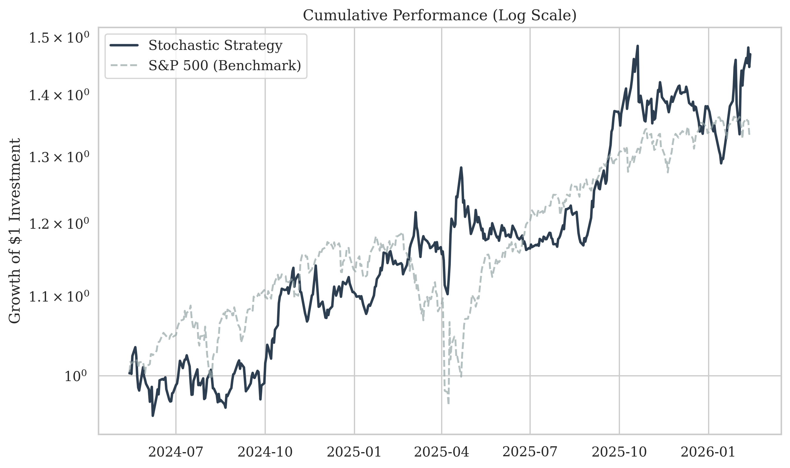
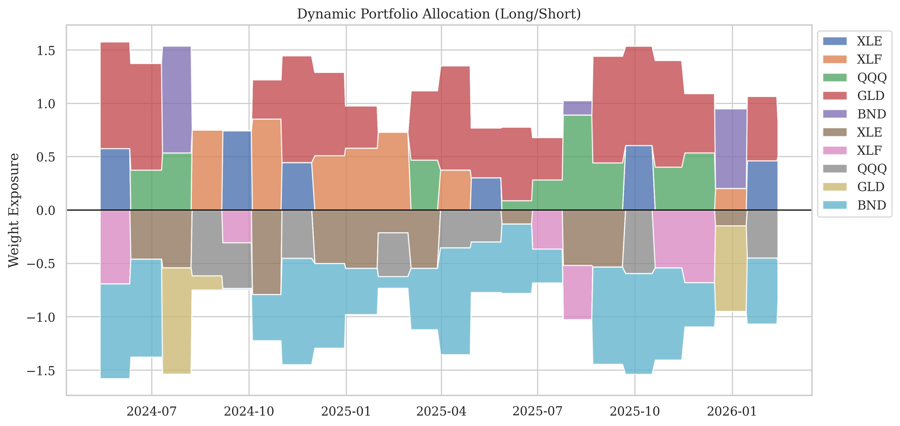
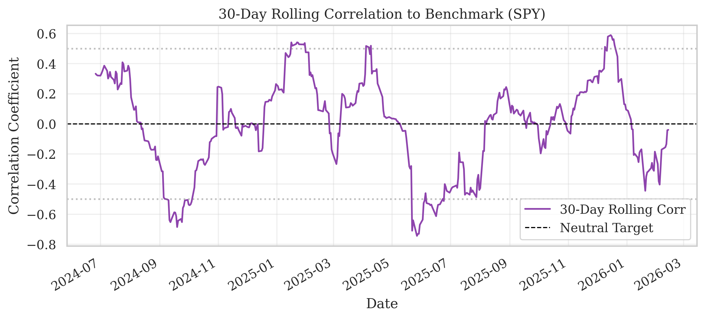
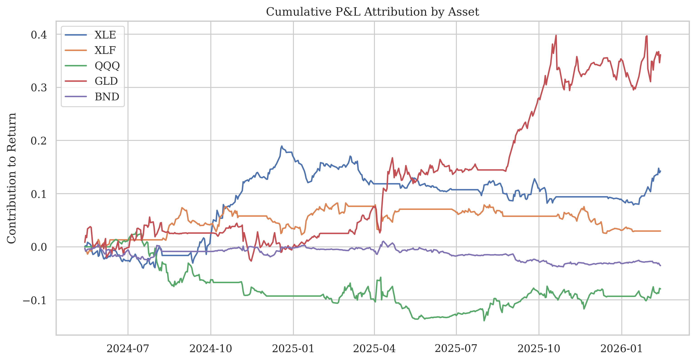

# OptiAlpha: Bayesian Stochastic Portfolio Optimization

**OptiAlpha** is a professional quantitative research framework designed to construct **Market Neutral** portfolios. It bridges the gap between **Probabilistic Modeling (Bayesian)** and **Constrained Optimization (MILP)** to generate alpha while strictly managing tail risk.

Unlike traditional Mean-Variance optimizers, this engine uses **Conditional Value at Risk (CVaR)** to limit losses in the worst-case scenarios of the Bayesian posterior distribution.

---

## 🏗 Architecture & Methodology

The project follows a rigorous "Walk-Forward" pipeline, simulating a real-world trading environment where the model adapts to changing market regimes.

### 1. Data Ingestion (Real-World Robustness)
* **Source:** Yahoo Finance (`yfinance`) via a custom `YahooConnector`.
* **Handling:** Uses **Adjusted Close** prices to account for stock splits and dividends, preventing "fake" signals common in raw data backtests.
* **Universe:** A liquid basket of ETFs representing major asset classes:
    * **Equity:** `QQQ` (Tech), `XLE` (Energy), `XLF` (Financials)
    * **Commodities:** `GLD` (Gold)
    * **Fixed Income:** `BND` (Total Bond Market)

### 2. Alpha Generation (Bayesian Inference)
Instead of a single point estimate (e.g., "Expected Return is 1%"), we generate a **probability distribution** of returns.
* **Model:** Analytical Bayesian Linear Regression (`BayesianRidge`).
* **Signal:** A rolling momentum factor ($P_t / P_{t-20} - 1$).
* **Benefit:** The model quantifies **uncertainty**. If the signal is noisy, the posterior distribution widens, prompting the optimizer to reduce position sizing automatically.

### 3. Portfolio Construction (Stochastic MILP)
We solve a **Mixed-Integer Linear Programming** problem at every rebalance step:
* **Objective:** Maximize Expected Alpha.
* **Constraint A (Market Neutral):** $\sum (Weight_i \times \beta_i) \approx 0$.
* **Constraint B (Dollar Neutral):** $\sum Longs = \sum Shorts$.
* **Constraint C (Risk):** $CVaR_{95\%} \le 2\%$ (Tail Risk Limit).

---

## 📊 Performance & Analysis

### 1. Equity Curve: Strategy vs. Benchmark
*The strategy aims for absolute returns uncorrelated to the S&P 500 (SPY). Note the stability during market drawdowns.*

### 2. Dynamic Allocation (The "Tunnel" Chart)
*Visualizing the active management. The optimizer dynamically shifts exposure between Long (Positive) and Short (Negative) based on the Bayesian signal strength.*

### 3. Rolling Correlation
*A key metric for Market Neutral strategies. Ideally, this line should oscillate around 0, proving the strategy is providing true diversification.*

### 4. P&L Attribution
*Breakdown of cumulative profit by asset. This identifies which sectors drove performance and which were hedges.*

---

## 🔬 Research Notebooks

The project is organized into a logical flow, moving from raw data exploration to full-scale production simulation.

### [1. Data Analysis & Regime Detection](./notebooks/01_Data_Analysis.ipynb)
* **Goal:** Validate data quality and understand asset characteristics.
* **Key Actions:** Fetches real-world adjusted close prices via `yfinance`, analyzes return distributions for "fat tails" (kurtosis), and computes correlation matrices to identify natural hedges within the universe.

### [2. Bayesian Modeling (Research)](./notebooks/02_Bayesian_Modeling.ipynb)
* **Goal:** Prove the concept of probabilistic signal generation.
* **Key Actions:** Uses `PyMC` to fit a Bayesian Linear Regression model on synthetic data. It demonstrates **parameter recovery**—proving the model can correctly identify hidden alpha and beta signals even in noisy environments.

### [3. Optimization Engine (Unit Test)](./notebooks/03_Optimization_Engine.ipynb)
* **Goal:** Verify the Mixed-Integer Linear Programming (MILP) constraints.
* **Key Actions:** Feeds specific probabilistic scenarios into the `StochasticOptimizer`. It confirms that the solver respects the **Market Neutral** ($\beta \approx 0$), **Dollar Neutral**, and **CVaR (Risk)** constraints before deployment.

### [5. Full Bayesian Backtest (Production)](./notebooks/05_Full_Bayesian_Backtest.ipynb)
* **Goal:** Execute the rolling-window simulation.
* **Key Actions:** The "Capstone" notebook. It integrates all components into a walk-forward analysis. The Bayesian model (optimized to `BayesianRidge` for speed) retrains every 20 days to adapt to new market regimes, driving the MILP optimizer to generate the final **Equity Curve** and **Attribution** reports.

## 🛠 Tech Stack

* **Data:** `yfinance`, `pandas`
* **Probabilistic Modeling:** `scikit-learn` (BayesianRidge), `pymc` (Research)
* **Optimization:** `pulp` (CBC Solver), `numpy`
* **Visualization:** `matplotlib`, `seaborn`
